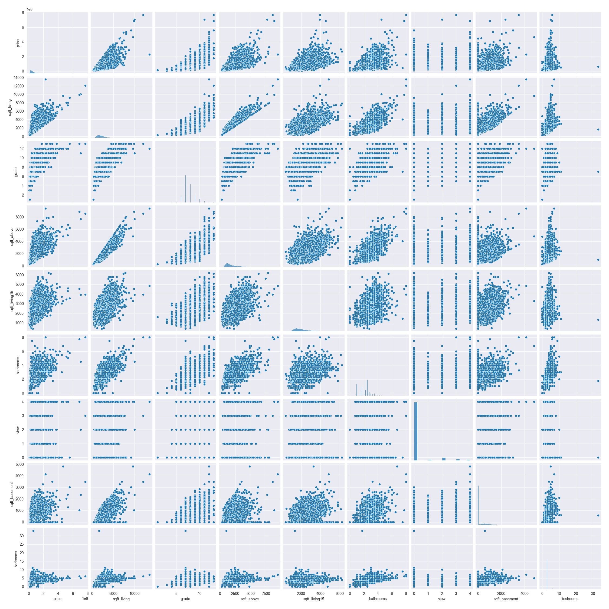
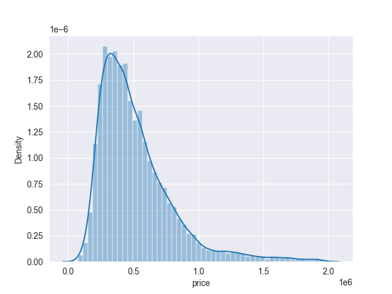

---

marp: true

---

# Решение задачи

> # Определение цены дома с использованием методов регрессии

## Работу подготовил:

> Боровик Никита

---

# Постановка задачи

В качестве задания требуется провести регрессионный анализ данных, 
для того чтобы оценить значение целевой переменной на основе факторных.

Полученные результаты методов **сравним** между собой.
> Грубо говоря, натренировать модели регрессионного анализа данных, выбрать **лучшую** и
> показать полученные результаты.

---

# Входные данные

- Дана база из **21613** домов
- У каждого дома есть **21** атрибут

---

# Атрибуты

Атрибуты имеют следующие названия:

- id
- date
- price
- bedrooms
- bathrooms
- sqft_living
- floors
- view
- grade и другие

> Целевой переменной является **price**

---

# Разведочный анализ
- Это процесс анализа данных в целях выявления основных характеристик,
закономерностей, аномалий и тенденций, с использованием различных методов.
- Основная цель разведочного анализа - получить более глубокое понимание 
структуры данных, выделить ключевые аспекты и гипотезы, которые 
могут быть дальше исследованы или применены в анализе данных.

---

# Корреляция атрибутов

    

---

# Матрица рассеяния
- Это графическое представление, в котором каждая пара переменных
в наборе данных представлена в виде диаграммы рассеяния.

- Матрица рассеяния используется для визуального исследования связей
и корреляций между парами переменных, позволяя аналитику быстро выявить
потенциальные зависимости и тенденции в данных.

- Каждая ячейка матрицы содержит график, показывающий, как взаимодействуют
две конкретные переменные, что помогает выявить структуры и паттерны в данных.
---
# Парная корреляция атрибутов

    

---

# Распределение целевой переменной

    

---

# После изменений в датасете

    

---

# Выбор моделей

Для решения проблемы регрессии были выбраны следующие модели:

- LinearRegression
- Ridge
- RandomForest
- CatBoostRegressor
> И далее расскажу о них подробнее, но сначала

---

# Что такое GridSearch?

**GridSearchCV** – это очень мощный инструмент для автоматического подбирания
параметров для моделей машинного обучения. Метод **поиска по сетке** находит
наилучшую комбинацию параметров, которые дают **наименьшую ошибку**,
путем обычного перебора: **он создает модель для каждой возможной комбинации параметров**.

---

# CV - кросс-валидация

**Кросс-валидация** работает путем разделения набора данных на несколько
поднаборов, называемых **фолдами**. Затем модель обучается и тестируется
несколько раз, каждый раз используя **разные фолды** для тестирования и обучения.

**RepeatedStratifiedKFold** – это вид кросс-валидации, который помогает
учесть разнообразие данных и уменьшить вероятность переобучения модели.
Его особенностью является стремление **сохранить баланс классов** в каждом фолде.
> Ну а теперь перейдем к реализации работы моделей

---

# Модель LinearRegression

> Метод линейной регрессии

Линейная регрессия представляет собой метод анализа данных, 
который предсказывает ценность неизвестных данных с помощью 
другого связанного и известного значения данных.
По своей сути простой метод линейной регрессии пытается построить
линейный график между двумя переменными данных, x и y. 

- Она **хороша** потому что отлично подходит для задач с **высокой размерностью данных**
- Она проста и ее работа не сильно затратна
- **Но** также она слишком чувствительна к выбросам, а также предполагает нормальное распределение данных

---

# Результат работы модели

- R2-Train **71.49%**

- R2-Test **70.92%**

- MAE: **107 105** (**19.83%** от средней цены)

- MSE: **23 652 943 407**

- RMSE: **153 795**

- Время работы: **2.18** секунд

---

# Подобранные параметры

- copy_X: **True**

- fit_intercept: **False**

- positive: **False**

---

# График работы модели

    

---

# Модель Ridge

> Ridge ♪

Ridge очень похож на LinearRegression, и является одним из методов понижения размерности.
Применяется для борьбы с избыточностью данных, когда независимые переменные коррелируют друг с другом,
вследствие чего проявляется неустойчивость оценок коэффициентов многомерной линейной регрессии.

- Она **удобна** в том, что использует нормальное распределение для оценки вероятностей, что делает его **простым**.
- Стоит использовать если имеются линейные зависимости
- **Но есть минусы**, ведь она не учитывает возможные взаимосвязи между признаками.

---

# Результат работы модели

- R2-Train **71.48%**

- R2-Test **70.92%**

- MAE: **107 093** (**19.83%** от средней цены)

- MSE: **23 656 799 782**

- RMSE: **153 807**

- Время работы: **1.72** секунд

---

# Подобранные параметры

- alpha: **0.99**
- copy_X: **True**
- fit_intercept: **False**
- max_iter: **5000**
- positive: **False**

---

# График работы модели

    

---

# Модель RandomForest

> Метод случайного леса

RandomForest, используя идею DecisionTree,создает лес из этих деревьев.
При предсказании модель усредняет (или взвешивает) предсказания
всех деревьев, что позволяет уменьшить дисперсию и повысить точность предсказаний.

- Чем глубже дерево, тем сложнее правила принятия решений и тем лучше модель.

- Она **хорошо** интерпретируема и способна обрабатывать нелинейные зависимости в данных.

- **Однако** могут создаваться слишком сложные деревья, которые плохо обобщают данные.

---

# Результат работы модели

- R2-Train **87.08%**

- R2-Test **87.92%**

- MAE: **61 820** (**11.45%** от средней цены)

- MSE: **9 828 505 795**

- RMSE: **99 138**

- Время работы: **33.47** секунд

---

# Подобранные параметры

- n_estimators: **120**

- max_depth: **45**

- max_leaf_nodes: **3000**

- min_samples_split: **5**

---

# График работы модели

    

---

# Зависимость n_estimators и R2-score

    

---

# Модель CatBoost
> Categorical Boosting

CatBoostRegressor - это регрессионная модель, входящая в состав
библиотеки CatBoost, разработанной Yandex. Данная модель представляет 
собой алгоритм градиентного бустнига, оптимизированный для работы с категориальными данными.

- Модель **из коробки** работает хорошо как с категориальными, 
так и с числовыми признаками.

- Но, к сожалению, CatBoost может требовать больше времени для обучения
по сравнению с некоторыми другими алгоритмами, особенно на больших наборах данных.

---

# Результат работы модели

- R2-Train **99.71%**

- R2-Test **90.12%**

- MAE: **58 269** (**10.79%** от средней цены)

- MSE: **8 031 476 269**

- RMSE: **89 618**

- Время работы: **8.85** секунд

---

# Подобранные параметры

- iterations: **1200**

- depth: **10**

- learning_rate: **0.1**

---

# График работы модели

    

---

# Итоги

В ходе проделанной работы было выявлено, что лучшей моделью
для определения цены дома оказалась модель CatBoostRegressor со значением **R2=90.12%** на тестовых данных

## Почему так?

- В данных хоть и заметны некоторые линейные зависимости, но их не хватило для высокого результата работы линейных моделей
- Случайный лес более мощная модель, которая способна подстраиваться под нелинейные зависимости, но, 
вероятно из-за подобранных параметров, показала себя немного хуже
- CatBoostRegressor же хорошо работает и без особого подбора параметров, вследствие чего получилось добиться большей точности

---

# Список литературы

- Документации **Sklearn**, **Pandas**, **CatBoost**
- Статьи с **habr.com**
